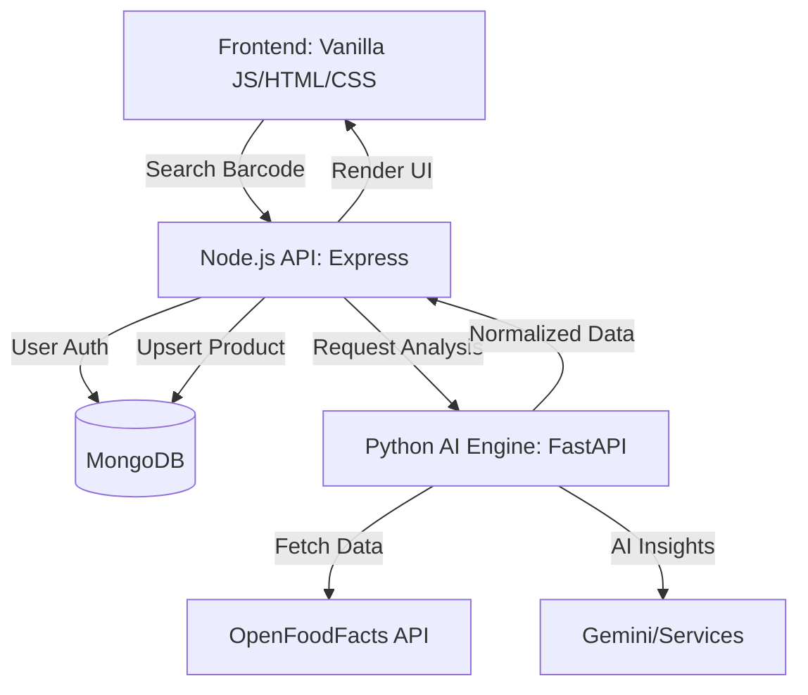

# 🥗 UnPackEat — AI-Powered Food Analyser

UnPackEat is a production-ready web application designed to help users make healthier dietary choices by providing instant, AI-driven analysis of food products based on barcodes and ingredient lists.

---

## 🏗️ System Architecture

The project follows a hybrid architecture combining the robustness of **Node.js** for user management and business logic with the power of **Python (FastAPI)** for AI-driven data processing.



---

## 🚀 Key Features

- **🔍 Smart Search**: Instant product lookup via barcode or name.
- **🧪 Deep Analysis**: Detailed breakdown of nutrition levels (Sugar, Sodium, Fat).
- **🤖 AI Insights**: Personalized health impact analysis and risk warnings.
- **🔄 Priority-based Lookup**: 
    1.  **Local DB**: High-speed access for previously analyzed products.
    2.  **AI Engine**: Live analysis for new products via Python backend.
- **🔐 Secure Access**: User registration, login, and personalized history tracking.
- **🗞️ Awareness Hub**: Daily food facts and health news to stay informed.

---

## 🛠️ Tech Stack

### Frontend
- **Vanilla JS**: High-performance, low-latency UI.
- **Bootstrap 5 & AOS**: Modern, responsive design with smooth animations.
- **EJS Mate**: Advanced layouts and partials for server-side rendering.

### Backend (Node.js)
- **Express**: Main application server.
- **Passport.js**: Robust authentication mechanism.
- **Mongoose**: Clean ODM for MongoDB integration.

### AI Engine (Python)
- **FastAPI**: Asynchronous high-performance API for data processing.
- **Processing Services**: Custom pipeline for data cleaning, normalization, and analysis.

---

## ⚙️ Setup & Installation

### 1. Prerequisites
- Node.js (v18+)
- Python (3.10+)
- MongoDB (Running locally on port 27017)

### 2. Node.js Server Setup
```bash
cd Server
npm install
node app.js
```

### 3. Python AI Engine Setup
```bash
cd Server/py-backend
python -m venv venv
source venv/bin/activate  # Windows: venv\Scripts\activate
pip install -r requirements.txt
fastapi dev main.py
```

---

## 📂 Project Structure

- `client/`: Frontend templates (`index.html`, `awareness.html`) and EJS views.
- `Server/`: Node.js Express server, routes (`/home`, `/analysis`), and user models.
- `Server/py-backend/`: Python AI engine with modular services for data normalization and AI insights.
- `client/users/public/`: Static assets (CSS, JS, Images).

---

## 🤝 Contribution

We welcome contributions! Please refer to the `Contribution.html` page in the app or submit a Pull Request.

---
*Developed as a practice project to explore AI integration in web ecosystems.*
